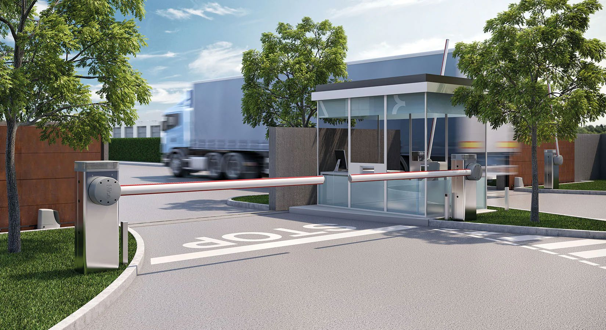

# Montion Control System
The barrier gate is quite common in the car park. Generally, it is composed of a motor, a rotating
bar, and a controller. In this lab, you are requested to design a mini barrier gate that can rotate 180
degrees instead of 90 degrees shown in Figure 1, and make it run smoothly with any given motion
profile.

**Figure 1. A barrier gate**
